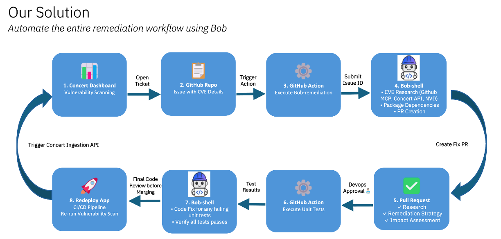

# Concert + Bob Vulnerability Remediation

This repo demonstrates an automated CVE remediation workflow using Concert + Bob, featuring a vulnerable Java application that replicates the 2017 Equifax data breach scenario.

## 📦 Demo Application

### CVE-2017-5638 - Equifax Breach Scenario
**Location**: `app/credit-app/`

A vulnerable credit reporting application built with Apache Struts 2.3.31, demonstrating **CVE-2017-5638** - the critical Remote Code Execution vulnerability exploited in the 2017 Equifax data breach that compromised 147 million records.

- **Vulnerability**: Apache Struts 2.3.31 (CVSS 10.0 - Critical)
- **Attack Vector**: OGNL injection via Content-Type header
- **Impact**: Remote Code Execution (RCE)
- **Real-World Impact**: 2017 Equifax breach (147M records)
- **Documentation**: See [app/credit-app/README.md](app/credit-app/README.md)

---

## Workflow Overview

We showcase an automated workflow for vulnerability remediation using Concert + Bob



## Workflow Overview
This automated [workflow](./.github/workflows/bob-shell-v2.yml) orchestrates CVE remediation through four key stages:

1. **DevOps Phase** - Bob Shell researches the CVE using Concert API and external sources (NVD, GitHub Advisory), performs false positive detection, then creates a PR with package upgrades (if needed)
2. **DevOps Approval** - DevOps engineer reviews and approves the package changes on GitHub UI
3. **Unit Testing** - Automated tests run against the upgraded dependencies to verify compatibility
4. **Code Remediation** - If tests fail, Bob Shell automatically fixes application code to work with the new package versions
5. **Merge & Deploy** - Software Lead assigned to perform code review before changes are merged and deployed to production

The workflow uses Bob Shell in two specialized modes: `devops-concert-shell-v2` for CVE research with false positive detection and package upgrades, while using `advanced` mode for code fixes. Each stage includes automated PR comments, reviewer assignments, and label management to track progress.

## False Positive Detection

The workflow includes intelligent false positive detection to prevent unnecessary package upgrades and potential breaking changes. Before creating a remediation PR, Bob Shell analyzes the codebase to determine if the CVE actually affects your application.

### Detection Process

1. **Extract CVE Context** - Parse the vulnerability details including CVE ID, package name, vulnerable functions, attack vectors, and severity
2. **Search Codebase** - Find all locations where the vulnerable package is imported or used
3. **Analyze Function Calls** - Determine if specific vulnerable functions are actually called in the code
4. **Evaluate Usage Context** - Trace data flow to understand if user input reaches vulnerable code paths
5. **Assess Deployment** - Consider if the service is exposed to untrusted users and what security controls exist
6. **Make Determination** - Decide if the CVE is a false positive or true positive based on evidence
7. **Document Analysis** - Create comprehensive documentation with file paths, code snippets, and reasoning
8. **Take Action** - Either comment on the issue (false positive) or proceed with remediation (true positive)

### Common False Positive Scenarios

- **Transitive Dependency** - Package is a dependency of a dependency, never directly used
- **Unused Feature** - Vulnerable feature of the package is not used (e.g., Flask app doesn't use cookies but CVE affects cookie parsing)
- **Unreachable Code** - Vulnerable functions exist but code paths are unreachable
- **Internal Only** - Service is internal-only, not exposed to untrusted users
- **Security Controls** - Input validation, WAF, or other controls prevent exploitation
- **Disabled Feature** - Vulnerable feature is disabled in configuration

### False Positive Workflow

When a false positive is detected:

1. Bob Shell creates a detailed comment on the GitHub issue with:
   - Summary of why it's a false positive
   - Code analysis with file paths and line numbers
   - Evidence showing the vulnerable code is not reachable
   - Exploitability assessment
   - Recommendation (no action required)

2. The DevOps engineer is tagged for review: `@devops-engineer`

3. **No branch or PR is created** - avoiding unnecessary work and potential breaking changes

4. The DevOps engineer can review the analysis and either:
   - Agree and close the issue
   - Disagree and manually trigger remediation

### True Positive Workflow

When a true positive is confirmed:

1. Bob Shell proceeds with the normal CVE remediation workflow
2. Creates a remediation branch
3. Updates package manifests with the fixed version
4. Commits and pushes changes
5. Creates a pull request with detailed CVE information
6. Workflow continues to DevOps approval stage

### Safety First Approach

When the analysis is inconclusive or uncertain, the workflow defaults to **TRUE POSITIVE** and proceeds with remediation. This ensures that potential vulnerabilities are not missed, even if it means some unnecessary upgrades.

### Initial Setup:
#### Configure the following Github Action Secrets
`https://github.com/highorbit25/concert-bob-remediate/settings/secrets/actions`

```
BOBSHELL_API_KEY="XXX"

BOBSHELL_MCP_CONFIG="{sample in .bob/mcp.json}"

CONCERT_API_KEY="C_API_KEY XXX"
```


#### Configure the following Github Action Variables
`https://github.com/highorbit25/concert-bob-remediate/settings/variables/actions`

```
CONCERT_HOSTNAME="https://162.133.134.XXX:12443"

CONCERT_INSTANCE_ID="0000-0000-0000-0000"

# To disable telemetry
BOBSHELL_SETTINGS={ "security": { "ibmTelemetry": { "enabled": false } } }

DEVOPS_REVIEWERS=['devops-user']

INGESTION_JOB_ID=92073c05-xxxx-xxxx-8408-89ed1341a592

LEAD_REVIEWERS=['swe-lead-user']

SWE_REVIEWERS=['swe-user']
```

#### Configure `devops-approval` Environments for DevOps Approval

`https://github.com/highorbit25/concert-bob-remediate/settings/environments`

1. Create `devops-approval` environment
2. Add `Deployment protection rules` > `Required reviewers` > Select `devops-user`

#### Reset scenario
To simulate clearing of vulnerabilities for the credit-app, use `pom-reset.xml`
```
cp pom-reset.xml pom.xml
```

To re-introduce vulnerabilities for the credit-app, use `pom-vuln.xml`
```
cp pom-vuln.xml pom.xml
```


### Bob shell
For development purposes, Bob shell is currently installed on the Github Actions runner when the Github Action is triggered, followed by the configuration of Github MCP server. The custom 'devops-concert-shell-v2' mode is also configured in the `.bob` directory in the repository. 

For an actual production setup, a dedicated Github runner with Bob shell installed and settings pre-configured can be used.

## Watch it in action (Click through Demo)
Enable voiceover to hear the narration. [Link to Demo](https://demo-now.techzone.ibm.com/psl/fmx0mz7)