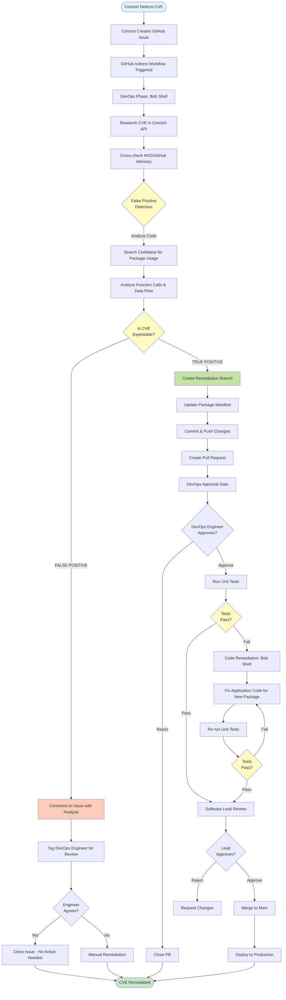
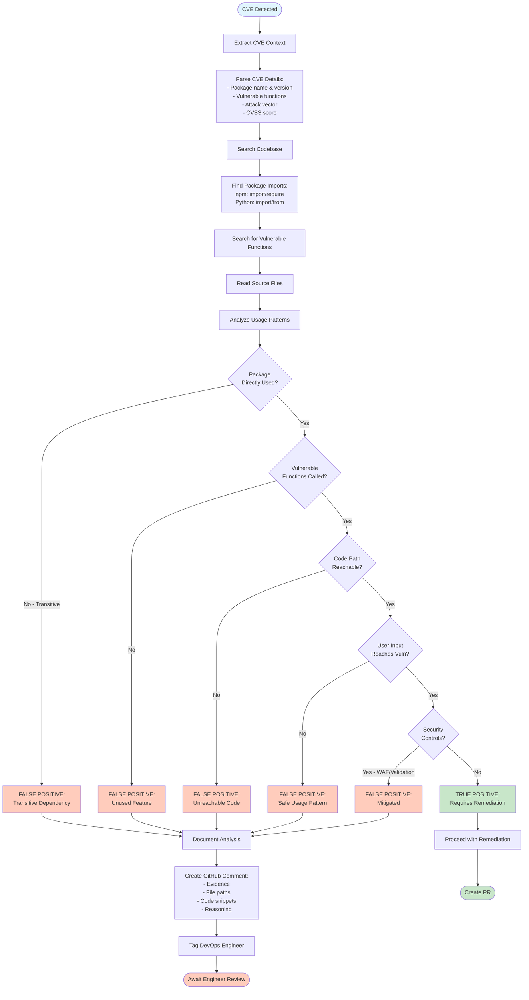
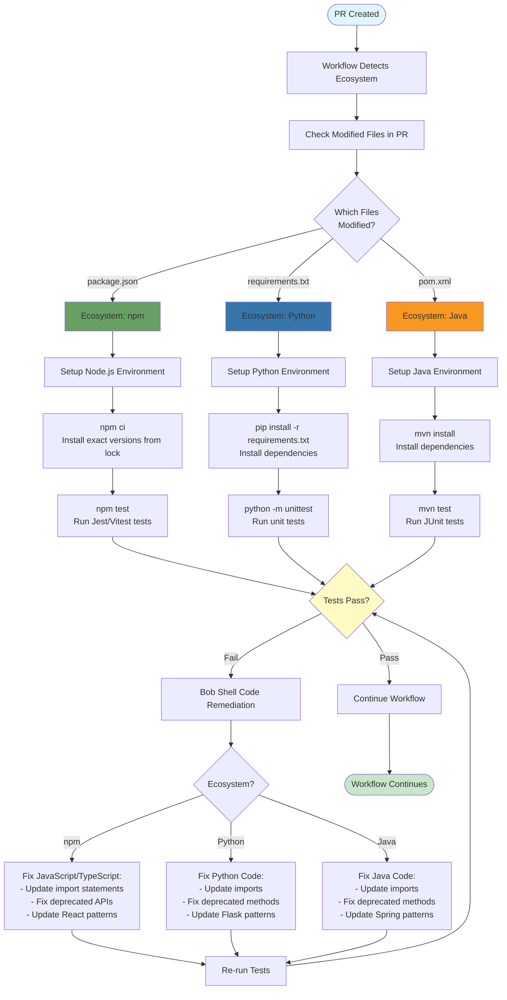
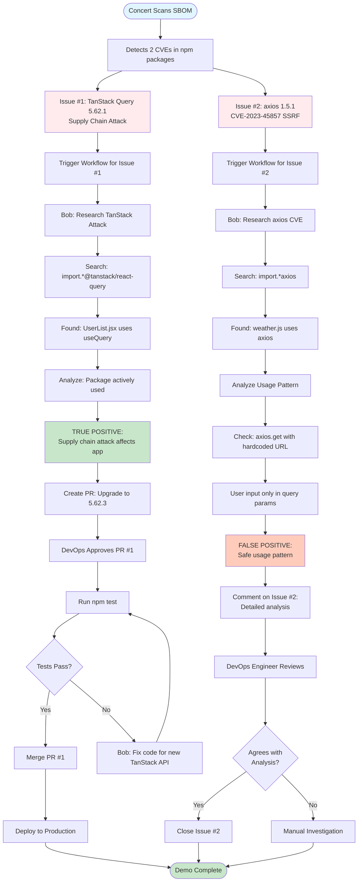
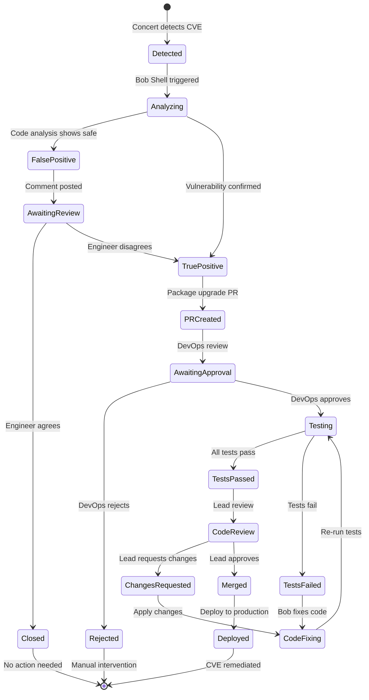
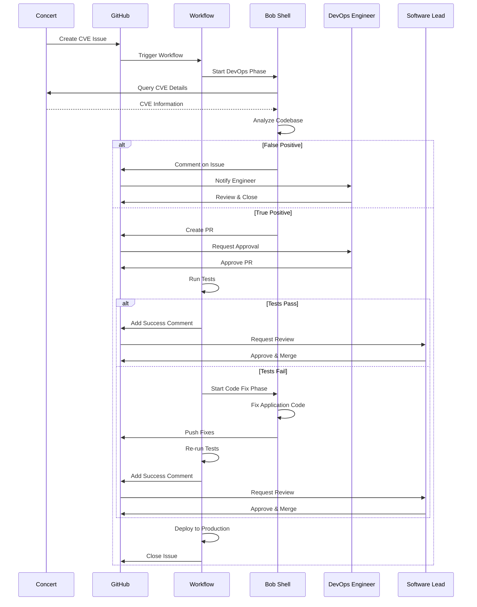

# Concert + Bob CVE Remediation Workflow Diagrams

This document contains visual representations of the automated CVE remediation workflow.

## Table of Contents
1. [Complete Workflow Overview](#complete-workflow-overview)
2. [False Positive Detection Flow](#false-positive-detection-flow)
3. [True Positive Remediation Flow](#true-positive-remediation-flow)
4. [Multi-Ecosystem Support](#multi-ecosystem-support)

---

## Complete Workflow Overview

This diagram shows the entire CVE remediation workflow from Concert detection to production deployment.



---

## False Positive Detection Flow

Detailed view of the intelligent false positive detection process.



---

## True Positive Remediation Flow

Detailed view of the package upgrade and code remediation process.

```mermaid
flowchart TD
    Start([TRUE POSITIVE Confirmed]) --> Branch[Create Branch:<br/>fix/cve-{ID}-{package}]
    Branch --> Manifest[Update Package Manifest]
    
    Manifest --> EcoCheck{Ecosystem?}
    EcoCheck -->|npm| NPM[Update package.json:<br/>- Change version<br/>- Add comment]
    EcoCheck -->|Python| PY[Update requirements.txt:<br/>- Change version<br/>- Add comment]
    EcoCheck -->|Java| JAVA[Update pom.xml:<br/>- Change version<br/>- Add comment]
    
    NPM --> Commit
    PY --> Commit
    JAVA --> Commit
    
    Commit[Commit Changes:<br/>fix: upgrade {pkg} to {ver} for CVE-{ID}]
    Commit --> Push[Push to Remote]
    Push --> PR[Create Pull Request:<br/>- CVE details<br/>- Concert recommendations<br/>- Link to issue]
    
    PR --> Label[Add Labels:<br/>- security<br/>- dependencies]
    Label --> Assign[Assign DevOps Reviewers]
    Assign --> Approval[DevOps Approval Gate]
    
    Approval --> Review{Approved?}
    Review -->|No| Close[Close PR]
    Review -->|Yes| Install[Install Dependencies]
    
    Install --> EcoTest{Ecosystem?}
    EcoTest -->|npm| NPMTest[npm ci && npm test]
    EcoTest -->|Python| PyTest[pip install && python -m unittest]
    EcoTest -->|Java| JavaTest[mvn test]
    
    NPMTest --> TestResult
    PyTest --> TestResult
    JavaTest --> TestResult
    
    TestResult{Tests Pass?}
    TestResult -->|Yes| Success[Add Success Comment]
    Success --> LeadReview[Assign Software Lead]
    
    TestResult -->|No| Failure[Add Failure Comment]
    Failure --> BobFix[Bob Shell: Advanced Mode]
    BobFix --> AnalyzeFail[Analyze Test Failures]
    AnalyzeFail --> FixCode[Fix Application Code:<br/>- Update deprecated APIs<br/>- Fix import paths<br/>- Update method calls]
    FixCode --> ReTest[Re-run Tests]
    ReTest --> TestResult2{Tests Pass?}
    TestResult2 -->|No| FixCode
    TestResult2 -->|Yes| Success
    
    LeadReview --> FinalReview{Lead Approves?}
    FinalReview -->|No| RequestChanges[Request Changes]
    FinalReview -->|Yes| Merge[Merge to Main]
    Merge --> Deploy[Deploy to Production]
    Deploy --> CloseIssue[Close GitHub Issue]
    CloseIssue --> End([CVE Remediated])
    
    Close --> End
    RequestChanges --> End

    style Start fill:#c8e6c9
    style End fill:#c8e6c9
    style TestResult fill:#fff9c4
    style TestResult2 fill:#fff9c4
    style Failure fill:#ffccbc
    style Success fill:#c8e6c9
```

---

## Multi-Ecosystem Support

How the workflow handles different package ecosystems (npm, Python, Java).



---

## TanStack Demo Scenario Flow

Specific flow for the TanStack supply chain attack demonstration.



---

## Workflow State Transitions

State diagram showing the lifecycle of a CVE issue.



---

## Actor Interactions

Sequence diagram showing interactions between different actors in the workflow.



---

## Key Workflow Features

### 1. Intelligent False Positive Detection
- Analyzes actual code usage patterns
- Prevents unnecessary package upgrades
- Reduces breaking changes
- Saves engineering time

### 2. Multi-Ecosystem Support
- Automatically detects npm, Python, or Java
- Runs appropriate test commands
- Handles ecosystem-specific patterns

### 3. Automated Code Remediation
- Fixes application code when tests fail
- Updates deprecated APIs
- Maintains functionality with new packages

### 4. Human-in-the-Loop Approval
- DevOps approval for package changes
- Software Lead approval for code changes
- Engineer review for false positives

### 5. Complete Traceability
- Links PRs to original CVE issues
- Documents Concert recommendations
- Tracks all changes and approvals

---

## Workflow Triggers

The workflow can be triggered in multiple ways:

1. **Automatic**: Concert detects CVE and creates GitHub issue
2. **Manual**: Engineer creates issue with CVE details
3. **Scheduled**: Periodic scans for new vulnerabilities
4. **On-Demand**: Manual workflow dispatch

## Success Metrics

- **Time to Remediation**: From CVE detection to production deployment
- **False Positive Rate**: Percentage of CVEs correctly identified as false positives
- **Test Success Rate**: Percentage of PRs that pass tests on first try
- **Manual Intervention Rate**: Percentage of CVEs requiring manual fixes
